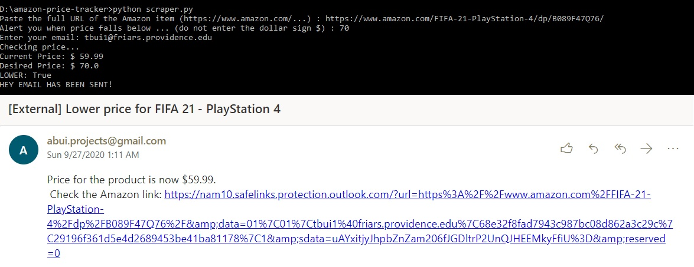

# Amazon Price Tracker
## Purpose
Have you ever been on the budget while having a Amazon item on your wishlist? This project will notify you of when your Amazon wishlist item drop to a desirable price.
## Features
A Python script to:
<ul>
  <li>track the price of an item on Amazon.com using requests and beautifulsoup</li>
  <li>automatically email user when price drops below a limit set by user with smtplib</li>
</ul>
 
</img>

## Usage
<ol>
  <li>Run <code>pip install -r requirements.txt</code></li>
  <li>Run <code>python scraper.py</code></li>
  <li>Input information</li>
</ol>

## Future Improvements
<ul>
  <li>Build a website for the web scraper with Flask and SQL</li>
  <li>Deploy and schedule web scraping on Heroku</li>

</ul>

